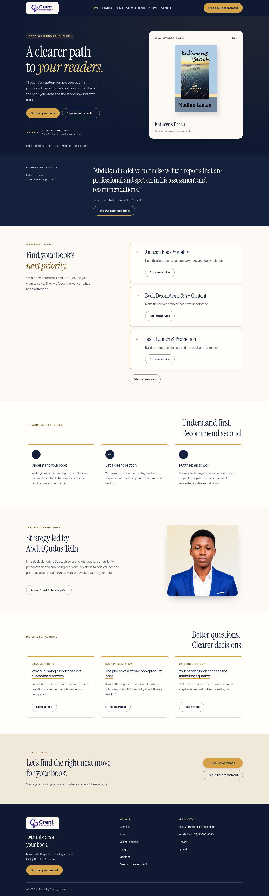

# Grant Publishing Co. 3.4.0 design review

The upgrade takes color, spacing and component cues from the user-confirmed [OW Publishing House reference](https://owpublishiing.com/), while preserving Grant's 17 pages, section order, copy, supplied imagery and existing Instrument Serif/Manrope fonts.

| Reference trait | Grant adaptation |
|---|---|
| Navy opening sections and compact sticky navigation | Navy heroes/header/footer with cream logo plates and readable white copy. |
| Warm cream and restrained gold | Cream page surfaces, warm borders and gold primary actions with navy labels; deeper gold for small text on light surfaces. |
| Serif hierarchy and generous spacing | Existing Grant fonts and headings retained, with consistent responsive spacing and clear section introductions. |
| Framed cards and grouped form fields | Service/article cards gain warm outlines and corners; contact forms gain a clear white panel and spacious fields. Static process/testimonial panels retain informational behavior. |
| Prominent founder image | Grant's supplied portrait stays large on Home/About, with a warm gold frame and responsive phone sizing. |
| Strong actions | Existing destinations, heading links, request/service selection, keyboard focus and form feedback remain; no invented project statistics or copied reference content. |

The reference's low-contrast small gold text and phone overflow were avoided. Grant's tested grids fit down to 320px; small light-surface gold text uses `#785719` rather than the lighter decorative gold. All 204 primary rendered combinations passed automated contrast/accessibility and overflow checks; details and limits are in the [testing report](TESTING-REPORT.md).

## Reference evidence

The image below shows OW Publishing House's Home opening section at 1440px. It is a local mirror of actual public HTML/CSS/assets downloaded with verified TLS on 8 October 2026. Direct Chromium navigation through the cloud proxy failed certificate validation, so this is labelled mirror evidence. Reference content/assets are not in the installable plugin.

## Grant before and after

These are local plugin fixture captures with the intended Grant fonts. “Before” is published version 3.3.0; “after” is 3.4.0. They are not screenshots of a live installation.

| Page | Before desktop | After desktop | Before phone | After phone |
|---|---|---|---|---|
| Home | [3.3](evidence/before-home-1440.png) | [3.4](evidence/after-home-1440.png) | [3.3](evidence/before-home-390.png) | [3.4](evidence/after-home-390.png) |
| About | [3.3](evidence/before-about-1440.png) | [3.4](evidence/after-about-1440.png) | [3.3](evidence/before-about-390.png) | [3.4](evidence/after-about-390.png) |
| Services | [3.3](evidence/before-services-1440.png) | [3.4](evidence/after-services-1440.png) | [3.3](evidence/before-services-390.png) | [3.4](evidence/after-services-390.png) |
| Contact | [3.3](evidence/before-contact-1440.png) | [3.4](evidence/after-contact-1440.png) | [3.3](evidence/before-contact-390.png) | [3.4](evidence/after-contact-390.png) |

### Updated Home

### Updated phone Contact

See [all 17 pages in the screenshot gallery](GALLERY.md), [installation instructions](INSTALLATION.md), and the [downloadable plugin ZIP](grant-publishing-site-3.4.0.zip). Existing Web3Forms provider/key settings remain saved when the plugin is replaced.
